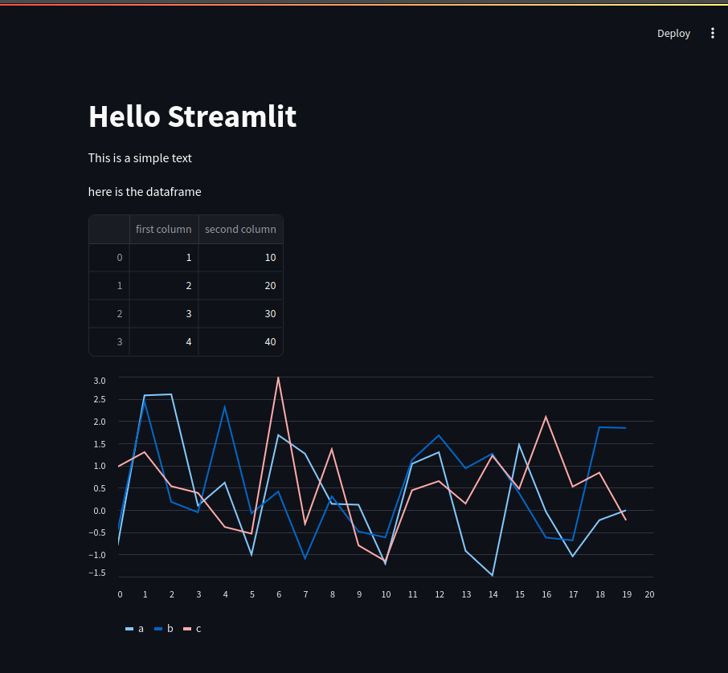

# Basic foundation of Python, Streamlit and NLP prerequisites

First of all setup the python environment, from the terminal:
```
conda create -p venv python=3.10
conda activate ./venv
```

Then install the python packages in the virtual environment
```
pip install -r readme.txt
```

## 1-Python-Basics
* basic python syntax
* dictionary
* tuples
* expeptions
* reading/writing text files
* import/export csv files
* import/export binary files

## 2-Classes
* constructors
* abstracts methods
* inheritance

## 3-Streamlit
* Table representation
* Widgets
* Charts


## 4-NLP prerequisites
* [Nltk](https://www.nltk.org/) library
* tokenizer for paragraphs
* tokenizer for sentences
* tokenizer for words
* stemming
* lemminization
* stopwords
* bag of words
* word2vet
